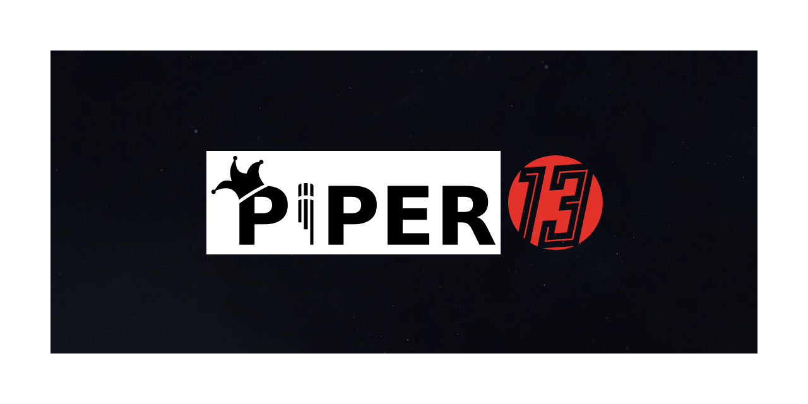

Written for [Yogstation13](https://github.com/yogstation13)

Written in [nestjs](https://github.com/nestjs/nest)

Uses [piper](https://github.com/rhasspy/piper), which can be found in `./piper-src`

#

`./piper-src` has been modified to point at [ynot01/piper-phonemize](https://github.com/ynot01/piper-phonemize) which points at a [specific rhasspy/espeak-ng commit](https://github.com/rhasspy/espeak-ng/commit/0f65aa301e0d6bae5e172cc74197d32a6182200f) to prevent breaking changes.

Piper voice models are individually licensed, please see `MODEL_CARD` under each voice folder (located in `./piper-voices`) to view attributions and licensing.

[For additional voices see here.](https://huggingface.co/rhasspy/piper-voices/) 

[For a model training guide & video tutorial see here.](https://github.com/rhasspy/piper/blob/master/TRAINING.md)

## Compiling & Testing

You will require [Docker](https://www.docker.com/)

To compile & start the server, run `docker compose up --build`

Exposes on port 8133

## API usage:

### Ping

GET

`/ping`

Requires no auth

returns "Hello, world!"

###

POST

`/tts_clear_cache`

Auth key should be send in header `Authorization` : `mysecurekey`

Clears out the backend cache of voices, should be used at the start of each round. Cache is expected to reach up to 1GB on particularly active rounds.

### TTS'

GET

`/tts?model={desired_model}&pitch={multiplier}`

Auth key should be send in header `Authorization` : `mysecurekey`

Message and filters should be in JSON body `{message: "Hello, world!", "filters":{"robotic":["roundstart"]}`

Models can be found in `./piper-voices` and should be queried as `country-name` i.e. `GB-alba`

Example usage: `/tts?model=US-joe&pitch=1`
